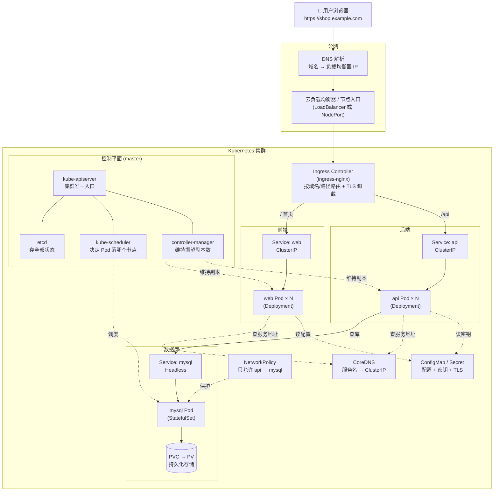

# CKA 备考学习仓库

面向 CKA（Certified Kubernetes Administrator）考试的本机实战学习仓库：从零搭建集群，到按考纲逐域攻克。

## 学习入口

先看总纲，它包含完整学习安排与文档导航：

- [CKA备考学习路线总纲.md](./CKA备考学习路线总纲.md) — 学习计划、6 周安排、文档索引

## 教程正文（按考纲顺序）

| 顺序 | 文档 | 内容 | 考纲权重 |
|------|------|------|----------|
| 第一部分 | [第一部分-本机搭建K8s集群教程.md](./第一部分-本机搭建K8s集群教程.md) | Minikube / Kind / Multipass+kubeadm 搭建 | 前置 |
| 第二部分 | [第二部分-工作负载与调度.md](./第二部分-工作负载与调度.md) | Pod/Deployment/ConfigMap/调度/静态Pod | 15% |
| 第三部分 | [第三部分-服务与网络.md](./第三部分-服务与网络.md) | Service/Ingress/Gateway/NetworkPolicy/DNS | 20% |
| 第四部分 | [第四部分-存储.md](./第四部分-存储.md) | PV/PVC/StorageClass | 10% |
| 第五部分 | [第五部分-集群架构安装与配置.md](./第五部分-集群架构安装与配置.md) | RBAC/kubeadm升级/etcd备份/HA | 25% |
| 第六部分 | [第六部分-故障排查.md](./第六部分-故障排查.md) | Pod/节点/控制面/网络排查 | 30% |
| 第七部分 | [第七部分-Rancher与Lens管理K8s集群教程.md](./第七部分-Rancher与Lens管理K8s集群教程.md) | Rancher、Lens/FreeLens 可视化管理 | 非考点 |

## 速查与辅助

| 文档 | 用途 |
|------|------|
| [CKA学习知识点总结.md](./CKA学习知识点总结.md) | 考纲知识点与命令速查 |

## 建议路径

搭好环境（第一部分）→ 按总纲的 6 周计划学第二~六部分 → 用知识点总结做考前速查 → Killer Shell 模拟考。

---

## 企业实战：一个用户请求是怎么跑到 K8s 里的

下面用**最常见的企业场景**——用户用浏览器访问一个电商网站 `https://shop.example.com` ——串起本仓库涉及的核心概念，帮助你把零散知识点连成一条线。

### 场景说明

- 前端 Web（无状态）：`web` Deployment，多副本，可弹性伸缩
- 后端 API（无状态）：`api` Deployment，多副本
- 数据库（有状态）：`mysql` StatefulSet + PVC 持久化
- 配置与密钥：ConfigMap（应用配置）、Secret（数据库密码、TLS 证书）
- 对外入口：Ingress（域名 + HTTPS）
- 安全隔离：NetworkPolicy 限制「只有 api 能连数据库」

### 架构流程图



> 若你的 Markdown 预览不支持 mermaid，可看下方 ASCII 版本。

```text
用户浏览器 https://shop.example.com
      │
      ▼
   DNS 解析（域名 → 入口 IP）
      │
      ▼
云负载均衡器 / NodePort（集群入口）
      │
      ▼
Ingress Controller（按域名/路径路由，卸载 HTTPS）
      ├── "/"     → Service(web)  → web Pod × N   ──┐
      └── "/api"  → Service(api)  → api Pod × N ──┐ │
                                                  │ │  ← 读 ConfigMap/Secret
                                                  ▼ ▼  ← 用 CoreDNS 找服务地址
                                        Service(mysql) → mysql Pod → PVC(持久化)
                                                  ▲
                                         NetworkPolicy 只放行 api → mysql

控制平面（幕后）：kube-apiserver ↔ etcd ↔ scheduler / controller-manager
                  持续保证「实际状态 = 期望状态」
```

### 请求流程逐步说明

| 步骤 | 发生了什么 | 涉及组件 | 对应教程 |
|------|-----------|----------|----------|
| 1 | 浏览器把 `shop.example.com` 通过 DNS 解析成入口 IP | 外部 DNS | — |
| 2 | 请求到达集群入口（云 LoadBalancer 或节点 NodePort） | Service(LoadBalancer/NodePort) | 第三部分 |
| 3 | Ingress Controller 按域名/路径分发，并做 HTTPS 卸载 | Ingress + TLS Secret | 第三部分 |
| 4 | `/` 转到前端 Service，负载均衡到某个 web Pod | Service(ClusterIP) + Deployment | 第二、三部分 |
| 5 | web/api Pod 通过 CoreDNS 用**服务名**找到其他服务 | CoreDNS | 第三部分 |
| 6 | api Pod 读取配置和密钥（如数据库地址、密码） | ConfigMap / Secret | 第二部分 |
| 7 | api 访问数据库 Service，落到 mysql Pod | Service + StatefulSet | 第二、三部分 |
| 8 | 数据库把数据写入持久卷，Pod 重建也不丢 | PVC / PV | 第四部分 |
| 9 | NetworkPolicy 确保只有 api 能连数据库，其他被拒 | NetworkPolicy | 第三部分 |
| 10 | 全程 kube-apiserver 把期望状态存在 etcd，控制器/调度器维持副本与调度 | 控制平面 | 第五部分 |

### 幕后：K8s 如何保证「服务一直在」

| 情况 | K8s 自愈动作 | 对应教程 |
|------|--------------|----------|
| 某个 web Pod 崩溃 | controller-manager 立即重建，维持副本数 | 第二部分 |
| 某个节点宕机 | Pod 被重新调度到其他节点 | 第二、六部分 |
| 流量高峰 | HPA 自动扩容 Pod（需 metrics-server） | 第二部分 |
| 发新版本 | Deployment 滚动更新，出问题可回滚 | 第二部分 |
| 配置变更 | 改 ConfigMap/Secret，滚动重启使其生效 | 第二部分 |
| 排查故障 | 沿 Service→Endpoints→Pod→日志 逐层定位 | 第六部分 |

> 这套「用户请求 → Ingress → Service → Pod，配置靠 ConfigMap/Secret，数据靠 PVC，安全靠 NetworkPolicy，稳定靠控制平面」的模式，是企业里最典型的 K8s 应用形态，几乎所有 CKA 考点都能在其中找到落点。
